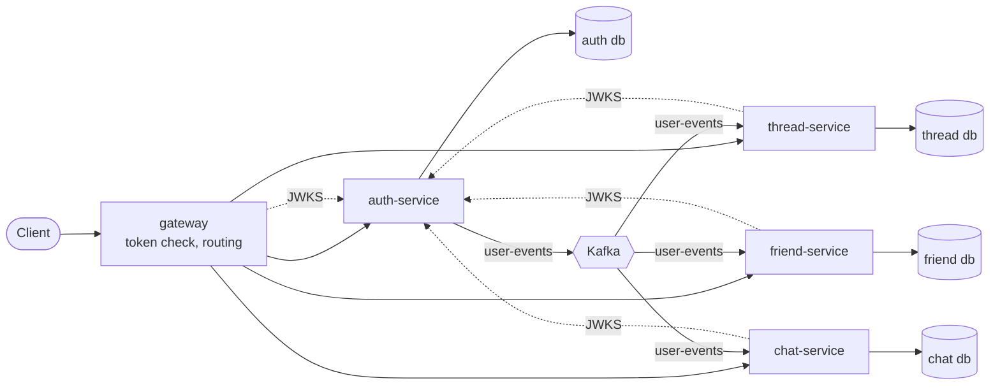

# Social Community Thread Backend

[](https://github.com/R4zor25/Social-Community-Thread-Backend/actions/workflows/ci.yml)

The backend of a social community platform with topic threads, posts, comments, votes, friends and chat. It is built as Kotlin and Spring Boot 4 microservices. Each service owns its own PostgreSQL database, the services share user data through Kafka events, and every service validates RS256 access tokens itself.

I wrote the first version in 2023 as my MSc thesis project at BME (Budapest University of Technology and Economics). In 2026 I rebuilt it; [what changed and why](#from-the-2023-version-to-this-one) is at the end. The design and the reasons behind it are in [docs/architecture.md](docs/architecture.md).

## Architecture



| Module | Responsibility |
|---|---|
| `gateway` | The only published port (`8080`). Validates the access token, routes `/api/v2/**` by path prefix, rejects bodies declared over 6 MB, and passes on the client's address. |
| `services/auth-service` | Registration, login, sessions and refresh tokens, profiles and avatars. Signs access tokens, publishes the key set (JWKS) and the `user-events` topic. |
| `services/thread-service` | Threads, posts, comments, votes, saved posts, followed threads and the feed. |
| `services/friend-service` | Friend requests and friendships. |
| `services/chat-service` | Conversations, participants and messages. |
| `libs/common-web` | Auto-configuration shared by the services: resource server setup, the current user, `ProblemDetail` errors, paging. |
| `libs/events` | Event contracts and the JSON fixtures that producer and consumer tests both use. |
| `libs/user-projection` | The consumer side of `user-events`: the `user_projection` table, its migration, the listener and the dead-letter setup. |
| `libs/test-support` | One shared set of Testcontainers (PostgreSQL, Kafka) for the integration tests. |
| `build/parent`, `build/coverage` | Versions and plugins for every module, and the aggregated JaCoCo report. |

### Main design decisions

- **Every piece of data has one owner.** Each service has its own database and database user, and its schema is managed by Flyway (Hibernate only validates it). No service contains another service's entities. Foreign keys cascade only inside an aggregate, for example from a thread to its posts, and never to users.
- **Users reach other services as events.** auth-service writes the user and an outbox row in one transaction, and a scheduled publisher sends `UserRegistered` to the compacted `user-events` topic, keyed by user id. The other services keep a read-only `user_projection` from it. The upsert is idempotent, and a record that keeps failing goes to `user-events.DLT`. A service also adds the **caller** to its projection from the token, so a user who has just registered can act before the event arrives. Other users must already be known from events; a friend request to an unknown user is `404`.
- **No trusted headers.** auth-service signs RS256 tokens (15 minutes, `iss`, `aud`, `kid`) and serves the public key at `/.well-known/jwks.json`, which the gateway does not route. The gateway and every service are OAuth2 resource servers and check the signature, expiry, issuer and audience themselves. When the key set cannot be fetched, the answer is `503`, not `401` or `500`.
- **Sessions.** Each login creates a session with a 256-bit refresh token, stored only as its SHA-256 hash, valid for 7 days and rotated on every refresh. Presenting a used token again revokes all of that user's sessions. Logins are throttled: 5 failures per username or 20 per client address within 15 minutes give `429` with `Retry-After`. The gateway sets `X-Forwarded-For` to the address it was connected from, so a client cannot choose its own.
- **Authorization next to the data.** For example, only a thread's creator may change it, only participants see a conversation, and only the recipient may accept a friend request. The caller always comes from the token, never from a path or body. Ids, authors, scores and timestamps in request bodies are ignored. Other users' email addresses are never returned.
- **Consistent API.** Errors are RFC 7807 `ProblemDetail`s, with field errors on validation failures. Lists are paged (`?page=&size=`, default size 20, maximum 100) and responses are assembled with one batch query per page instead of N+1 queries. Votes, follows, saves and adding participants are idempotent: `PUT` sets and `DELETE` clears. Concurrent votes are serialized with a row lock.

## API

Every path is under `/api/v2` on the gateway. Apart from register, login, refresh and logout, every request needs `Authorization: Bearer <access token>`.

| Service | Endpoints |
|---|---|
| auth | `POST /auth/register`, `/auth/login`, `/auth/refresh`, `/auth/logout`<br/>`GET /users/me`, `GET /users/{id}`, `GET /users?username=`<br/>`PUT /users/me/avatar`, `GET /users/{id}/avatar` |
| thread | `GET`, `POST /threads` (`?query=&followed=`)<br/>`GET`, `PATCH`, `DELETE /threads/{id}`<br/>`PUT`, `DELETE /threads/{id}/follow`<br/>`PUT`, `GET /threads/{id}/image`<br/>`GET`, `POST /threads/{id}/posts` (`?query=`)<br/>`GET /posts?authorId=&saved=&voted=UP\|DOWN`<br/>`GET`, `DELETE /posts/{id}`<br/>`PUT`, `DELETE /posts/{id}/vote`, `/posts/{id}/save`<br/>`PUT`, `GET /posts/{id}/attachment`<br/>`GET`, `POST /posts/{id}/comments`<br/>`PUT`, `DELETE /comments/{id}/vote`<br/>`GET /feed` |
| friend | `GET /friends`, `DELETE /friends/{userId}`<br/>`GET /friend-requests?direction=incoming\|outgoing`, `POST /friend-requests`<br/>`POST /friend-requests/{id}/accept`, `/decline`, `DELETE /friend-requests/{id}` |
| chat | `GET`, `POST /conversations`<br/>`GET /conversations/{id}`<br/>`GET`, `POST /conversations/{id}/messages`<br/>`POST /conversations/{id}/participants`, `DELETE /conversations/{id}/participants/{userId}`<br/>`PUT`, `GET /conversations/{id}/image` |

Each service publishes its OpenAPI document at `/v3/api-docs`. Only the gateway publishes a port, so read a document from inside the container, for example:

```bash
docker compose exec thread-service curl -s localhost:8080/v3/api-docs
```

A short session against a running stack:

```bash
curl -s -X POST localhost:8080/api/v2/auth/register -H 'Content-Type: application/json' \
  -d '{"username":"alice","email":"alice@example.com","password":"correct horse"}'
token=$(curl -s -X POST localhost:8080/api/v2/auth/login -H 'Content-Type: application/json' \
  -d '{"username":"alice","password":"correct horse"}' | sed 's/.*"accessToken":"\([^"]*\)".*/\1/')
curl -s -X POST localhost:8080/api/v2/threads -H "Authorization: Bearer $token" \
  -H 'Content-Type: application/json' -d '{"name":"Kotlin","description":"All things Kotlin"}'
```

## Running locally

Requirements: Docker with Compose v2, and OpenSSL for the keys. Java 21 is needed only to build or test outside Docker.

```bash
scripts/generate-keys.sh          # RSA key pair for signing tokens, into secrets/ (git-ignored)
cp .env.example .env              # then replace every password, e.g. with openssl rand -hex 16
docker compose up --build --wait
scripts/smoke-test.sh
docker compose down -v            # stop and remove the volumes
```

Compose starts PostgreSQL (one instance with one database and one user per service), Kafka (a single KRaft node), the four services and the gateway on `http://localhost:8080`. A service starts only when its database and Kafka are healthy, and it fails at startup when required configuration is missing.

`scripts/smoke-test.sh` runs about 50 checks through the gateway:

- **auth:** registration, refresh rotation and reuse detection, logout, and a missing or tampered token.
- **threads:** a thread with a post, comment, vote and save, and another user's edit being rejected.
- **friends:** a friend request to a user that friend-service knows only from the event.
- **chat:** a conversation with a message, a non-participant being rejected, and leaving.

## Tests

```bash
./mvnw verify                                       # every module; needs Docker for Testcontainers
./mvnw -pl services/chat-service -am verify         # one service and the modules it depends on
```

| Level | What it covers |
|---|---|
| Unit | Domain rules such as vote deltas, refresh rotation and reuse, login throttling, and who may remove a chat participant. |
| Integration | Each service against real PostgreSQL and Kafka (Testcontainers), through MockMvc with test tokens: migrations validated by Hibernate, status codes and `ProblemDetail` bodies, ownership rules, deletes that remove exactly the owned rows, concurrent votes, the outbox, projection upserts and dead-letter routing. |
| Contract | The producer emits, and every consumer reads, the event fixtures in `libs/events`. |
| End to end | The smoke test against the Compose stack. |

All integration tests of a service share one Spring context and one set of containers, and tables are truncated between tests. There is no H2 and no `@DirtiesContext`.

CI (GitHub Actions) runs `./mvnw verify`, uploads the aggregated JaCoCo report as the `coverage-report` artifact, and then runs the smoke test against the Compose stack. The actions are pinned to commit SHAs, and Dependabot proposes Maven, Actions and Docker updates weekly.

## Tech stack

- Kotlin 2.2, Java 21, Spring Boot 4.0, Spring Cloud 2025.1 (Gateway Server WebFlux)
- Spring Security OAuth2 resource server, Nimbus JOSE (RS256, JWKS)
- Spring Data JPA, Flyway, PostgreSQL 16
- Spring for Apache Kafka, Kafka 4 (KRaft)
- springdoc-openapi
- JUnit, MockK, AssertJ, Testcontainers, JaCoCo
- Maven, Docker, Docker Compose, GitHub Actions

## Known limitations

These are deliberate scope limits, not oversights:

- **Binary content in the database.** Images and attachments are `bytea` columns, limited to 5 MB. Object storage with presigned URLs would be the next step.
- **Users cannot be renamed or deleted.** There are no `UserRenamed` or `UserDeleted` events yet, so the projections only ever grow.
- **Per-instance login throttling.** The throttle counters are in memory. With more than one auth-service instance they would have to move to a shared store such as Redis, ideally together with rate limiting at the gateway.
- **Retrying `503`.** The gateway and the services answer `503` while the key set cannot be fetched, for example while auth-service starts. Clients should retry.
- **Topic settings are applied once.** auth-service creates `user-events` at startup, and Kafka does not change an existing topic's configuration. A changed partition count or retention has to be applied with the Kafka tools.
- **One database server.** Compose runs one PostgreSQL instance for all four databases, with separate users and no cross-database access. The services know only their own connection settings, so separate servers need no code change.
- **Polling outbox.** The outbox publisher polls the table. Change data capture (for example Debezium) would remove the polling delay.
- **Not covered.** Tracing, metrics, centralized logs, Kubernetes manifests and CORS (there is no browser client yet).

## From the 2023 version to this one

The 2023 version was a distributed monolith. Four services shared one database schema and kept copies of the same JPA entities, Hibernate created the schema, and Eureka and a config server tied the services together. Its security had real holes:

- the gateway never actually validated tokens,
- the services trusted a user id from the URL, so anyone could read and change anyone's data,
- deleting a post cascaded to its author,
- the refresh tokens were readable without authentication,
- secrets were committed.

I fixed those first, then rebuilt the system service by service around data ownership. The git history follows that path in thematic commits. The old design and every problem I found in it are described in [docs/architecture.md](docs/architecture.md#context) and in the commit messages.

The main lesson: I had split the system into services before deciding who owns which data, and the tests ran on H2, which behaved differently from PostgreSQL. As a result, several bugs only showed up once the whole stack ran together for the first time. Today I start from the data boundaries, put migrations, Testcontainers and a Compose smoke test in place from the first commit, and keep authorization next to the data.
