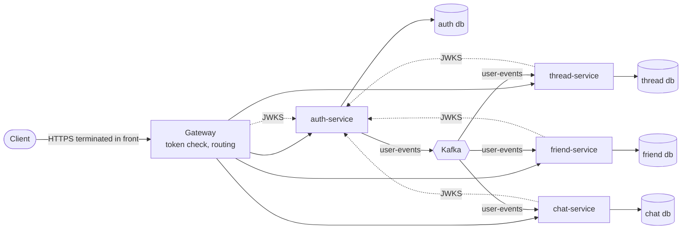

# Architecture

This document describes the architecture of the backend and how the codebase got there from the 2023 version. It records the decisions and the reasons behind them.

## Context

The 2023 version is a distributed monolith. Four Spring Boot services share one PostgreSQL schema, each service contains copies of the same JPA entities (`AppUser`, `ThreadPost`, `TopicThread`, `CommentModel`), and Hibernate manages the schema. A change to the data model has to be made in four places, nothing enforces that the copies stay in sync, and the services cannot be deployed or changed independently.

## Goals

- Every piece of data has exactly one owning service, stored in that service's own database.
- No service contains another service's entities. Data owned by another service is referenced by id. Where it is needed for display, the service keeps a narrow read-only projection of it, updated from events.
- Every service validates the caller's token itself. No service trusts a header set by another component.
- A clean, consistent REST API (`/api/v2`).
- Versioned schema migrations, tests against real PostgreSQL and Kafka, and one command to run the whole system.

## Non-goals

These are deliberately left out and listed under [Next steps](#next-steps):

- object storage for binary content,
- distributed tracing and metrics,
- Kubernetes manifests,
- deleting or renaming users.

## Overview



| Component | Responsibility |
|---|---|
| `gateway` | Single entry point. Validates the access token, routes `/api/v2/**` by path prefix, and rejects requests larger than 6 MB (`413`), which leaves room for a 5 MB upload. |
| `auth-service` | Identity: registration, login, sessions and refresh tokens, user profiles and avatars. Issues tokens, publishes the JWKS, and publishes user events. |
| `thread-service` | Topic threads, posts, comments, votes, saved posts, followed threads, the feed. |
| `friend-service` | Friend requests and friendships. |
| `chat-service` | Conversations, participants and messages. |
| `libs/common-web` | Shared web and security setup: resource-server configuration, current user, `ProblemDetail` errors, paging. |
| `libs/events` | Event contracts (data classes and JSON fixtures) shared by the producer and the consumers. |
| `libs/user-projection` | The consumer side of `user-events`: the `user_projection` table and its migration (`V1`, so service migrations start at `V2`), the listener, the dead-letter setup and the batch username lookup. |
| `libs/test-support` | One set of Testcontainers (PostgreSQL, Kafka) with `@ServiceConnection`, shared by every service's integration tests. |

Service discovery and the config server are removed. In Compose the gateway reaches the services through Docker DNS names, and on a platform such as Kubernetes the platform provides discovery. All configuration comes from environment variables.

## Data ownership

Each service has its own database and its own database user, with access to that database only. Flyway owns the schema, and Hibernate only validates it (`ddl-auto=validate`). Entities are flat: they reference each other by id instead of mapping JPA relations, and responses are assembled with one batch query per page. Binary content sits in its own table next to its owner, so lists never load it.

### auth-service

| Table | Columns | Notes |
|---|---|---|
| `users` | `id`, `username`, `email`, `password_hash`, `created_at`; username and email unique case-insensitively | The email is visible only to the user themselves. |
| `user_avatars` | `user_id` (primary key), `content`, `content_type` | |
| `sessions` | `id` (uuid), `user_id`, `created_at`, `revoked_at` | One session per login, for example one per device. |
| `refresh_tokens` | `token_hash` (SHA-256, primary key), `session_id`, `expires_at`, `used_at` | Every refresh issues a new token and marks the old one as used. |
| `outbox` | `id` (uuid), `aggregate_id`, `type`, `payload` (jsonb), `created_at`, `published_at` | Written in the same transaction as the change it describes. |

### thread-service

| Table | Columns | Notes |
|---|---|---|
| `user_projection` | `user_id` (primary key), `username`, `updated_at` | Filled from `user-events`. |
| `threads` | `id`, `name`, `description`, `creator_id`, `created_at` | Only the creator may change or delete a thread. |
| `thread_images` | `thread_id` (primary key), `content`, `content_type` | |
| `thread_followers` | `thread_id`, `user_id`, `followed_at`, primary key (`thread_id`, `user_id`) | |
| `posts` | `id`, `thread_id`, `author_id`, `title`, `body`, `tags` (text[]), `score`, `created_at` | `score` is the sum of the votes, maintained atomically. |
| `post_attachments` | `post_id` (primary key), `content`, `content_type` | |
| `post_votes` | `post_id`, `user_id`, `direction` (+1 or -1), primary key (`post_id`, `user_id`) | One vote per user and post. |
| `saved_posts` | `user_id`, `post_id`, `saved_at`, primary key: both | |
| `comments` | `id`, `post_id`, `author_id`, `body`, `score`, `created_at` | |
| `comment_votes` | `comment_id`, `user_id`, `direction`, primary key: both | |

Within the service, the foreign keys use `ON DELETE CASCADE` from a thread to its posts, and from a post to its comments, votes and saves. Deleting a thread or post removes exactly what belongs to it. The database never cascades to users, because users are not owned here.

A vote runs in one transaction: it locks the post row (`SELECT ... FOR UPDATE`), inserts, changes or deletes the `post_votes` row, and adds the difference between the old and the new direction to `score`. Concurrent votes on one post are serialized, and a repeated vote changes nothing.

### friend-service

| Table | Columns | Notes |
|---|---|---|
| `user_projection` | `user_id`, `username`, `updated_at` | |
| `friend_requests` | `id`, `sender_id`, `recipient_id`, `created_at`; unique per pair in either direction (`least`/`greatest` index) | Pending requests only. Accept, decline and revoke delete the row. |
| `friendships` | `user_low`, `user_high`, `created_at`, primary key: both, check `user_low < user_high` | Each pair is stored once. |

A request is rejected with:

- `400` when it is sent to the sender themselves,
- `404` when the recipient is unknown to the projection,
- `409` when a request already exists in either direction or the users are already friends.

### chat-service

| Table | Columns | Notes |
|---|---|---|
| `user_projection` | `user_id`, `username`, `updated_at` | |
| `conversations` | `id`, `name`, `creator_id`, `created_at`, `last_message_at` | |
| `conversation_images` | `conversation_id` (primary key), `content`, `content_type` | |
| `conversation_participants` | `conversation_id`, `user_id`, `joined_at`, primary key: both | |
| `messages` | `id`, `conversation_id`, `author_id`, `body`, `sent_at` | |

Only participants can read a conversation, send to it or change its participants. Any participant may leave. Only the creator may remove other participants. A conversation is deleted when its last participant leaves.

### Binary content

Avatars, thread images, post attachments and conversation images stay in the owning service's database as `bytea`. They are uploaded and downloaded as separate binary resources, limited to `image/*` (post attachments also allow `video/*`) and 5 MB. Only the media type is stored, without parameters such as `charset`. Moving them to object storage is a next step.

## Events

| Aspect | Decision |
|---|---|
| Topic | `user-events`, 3 partitions, compacted, created by auth-service, which owns it. `user-events.DLT` is created next to it. Kafka does not auto-create topics. |
| Key | `userId`, so all events of one user are ordered. |
| Envelope | `{ "eventId": uuid, "type": "UserRegistered", "version": 1, "occurredAt": instant, "payload": { ... } }` |
| Events | `UserRegistered { userId, username }`. New types can be added without changing existing consumers. |
| Producing | Transactional outbox. The `users` row and the `outbox` row are written in one transaction. A scheduled publisher reads unpublished rows in creation order (`FOR UPDATE SKIP LOCKED`), sends them, and sets `published_at`. Delivery is at least once. |
| Consuming | One consumer group per service. Each consumer upserts the projection (`INSERT ... ON CONFLICT (user_id) DO UPDATE`), so duplicates are harmless. After 3 retries with backoff, a record goes to `user-events.DLT`. |
| Format | JSON. The event classes and sample JSON fixtures live in `libs/events`. |

A user who has just registered may call another service before the event arrives there. For that reason each service also upserts the **caller** into its projection from the token claims (`sub`, `preferred_username`) before it stores data that references them. References to **other** users rely on the projection only. For example, a friend request to a user who is not yet in the projection returns `404`. This is why events are needed and the token alone is not enough.

## Authentication

| Aspect | Decision |
|---|---|
| Access token | JWT, RS256. Claims: `sub` (user id), `preferred_username`, `iss`, `aud` (`social-community`), `iat`, `exp`, `jti`. Lifetime 15 minutes. |
| Keys | RSA 2048 key pair in PEM files, created by `scripts/generate-keys.sh` into `secrets/` (git-ignored) and mounted read-only. The key id (`kid`) is the key's SHA-256 thumbprint. |
| Key publication | `GET /.well-known/jwks.json` on auth-service. It is internal and not routed by the gateway. |
| Validation | The gateway (reactive) and every service (servlet) are OAuth2 resource servers. They fetch and cache the JWKS, and validate the signature, `exp`, `iss` and `aud`. |
| Refresh token | 256-bit random opaque value. Only its SHA-256 hash is stored. Lifetime 7 days, rotated on every refresh. If a token that was already used is presented again, every session of that user is revoked. |
| Logout | `POST /api/v2/auth/logout` with the refresh token revokes that session. Access tokens expire on their own. |
| Passwords | BCrypt through `DelegatingPasswordEncoder`. |
| Registration rules | Username of 3–32 characters (letters, digits, `_`, `.`, `-`), a valid email address, and a password of 8–128 characters. A taken username or email returns `409`. |
| Login throttling | After 5 failed logins for a username, or 20 from one IP address, within 15 minutes, further attempts get `429` with `Retry-After`. Failed logins return `401`. The counters are in memory, so they apply per instance. |
| Authorization | Ownership and membership checks live in the owning service next to the data: thread creator, post author, conversation participant, friend request recipient or sender. |

## API (v2)

Conventions:

- Every path is under `/api/v2`, and each path prefix belongs to exactly one service.
- The caller is always taken from the token. User ids never identify the caller in a path.
- Paths are nouns, without verbs.
- Lists are paged with `?page=&size=` (default 0 and 20, maximum 100) and return `{ items, page, size, totalItems, totalPages }`.
- Errors use RFC 7807 `ProblemDetail`, with field errors for validation failures.
- Requests and responses are DTOs. Timestamps are ISO-8601 and ids are numbers.
- Each service publishes an OpenAPI document (springdoc).

| Service | Endpoints |
|---|---|
| auth | `POST /auth/register`, `POST /auth/login`, `POST /auth/refresh`, `POST /auth/logout` (all public)<br/>`GET /users/me`<br/>`GET /users/{id}`, `GET /users?username=`<br/>`PUT /users/me/avatar`, `GET /users/{id}/avatar` |
| thread | `GET /threads?query=&followed=true`, `POST /threads`<br/>`GET`, `PATCH`, `DELETE /threads/{id}`<br/>`PUT`, `DELETE /threads/{id}/follow`<br/>`PUT`, `GET /threads/{id}/image`<br/>`GET`, `POST /threads/{id}/posts` (`GET` takes `?query=`)<br/>`GET /posts?authorId=&saved=true&voted=UP\|DOWN`<br/>`GET`, `DELETE /posts/{id}`<br/>`PUT`, `DELETE /posts/{id}/vote`<br/>`PUT`, `DELETE /posts/{id}/save`<br/>`PUT`, `GET /posts/{id}/attachment`<br/>`GET`, `POST /posts/{id}/comments`<br/>`PUT`, `DELETE /comments/{id}/vote`<br/>`GET /feed` |
| friend | `GET /friends`, `DELETE /friends/{userId}`<br/>`GET /friend-requests?direction=incoming\|outgoing`, `POST /friend-requests`<br/>`POST /friend-requests/{id}/accept`, `POST /friend-requests/{id}/decline`, `DELETE /friend-requests/{id}` |
| chat | `GET /conversations`, `POST /conversations`<br/>`GET /conversations/{id}`<br/>`GET`, `POST /conversations/{id}/messages`<br/>`POST /conversations/{id}/participants`, `DELETE /conversations/{id}/participants/{userId}`<br/>`PUT`, `GET /conversations/{id}/image` |

Votes are idempotent. `PUT` sets the direction and `DELETE` clears it, so a repeated request never flips a vote. Fields the server owns, such as ids, authors, scores and timestamps, are never read from a request body.

## Build and infrastructure

```
pom.xml                    aggregator only
build/parent/              Spring Boot 4, Spring Cloud, Kotlin 2, Java 21, plugin setup
gateway/
services/auth-service/
services/thread-service/
services/friend-service/
services/chat-service/
build/coverage/            aggregated JaCoCo report
libs/common-web/
libs/events/
libs/user-projection/
libs/test-support/
docker/postgres/init.sh    one database and one user per service
scripts/                   generate-keys.sh, smoke-test.sh
```

- **Versions.** The exact versions are pinned once, in `build/parent`. Kotlin uses the `spring` and `jpa` compiler plugins, and all-open covers `@Entity`, `@MappedSuperclass` and `@Embeddable`. Lombok is not used.
- **Package layout.** Packages are organized per service by layer: `api` (controllers, DTOs), `domain` (entities, services, rules), `persistence` (repositories), `messaging` (publisher, consumers). For example: `hu.bme.aut.thread.domain`.
- **Compose.** It runs `postgres` (one instance, four databases), `kafka` (single node, KRaft) and the four services, then the gateway. Only the gateway publishes a port to the host, `8080`, and every service listens on `8080` inside its container. Readiness covers the database and Kafka. Missing required configuration stops a service at startup.
- **Image.** One parameterized multi-stage `Dockerfile` (`ARG MODULE`) on `eclipse-temurin:21`, running as a non-root user.
- **CI.**
  - `./mvnw verify`, with Testcontainers,
  - a JaCoCo aggregate report as an artifact,
  - the Compose smoke test,
  - Actions pinned to commit SHAs,
  - Dependabot for Maven, Actions and Docker.

In Compose one PostgreSQL instance hosts all four databases, with separate users, as a local-development compromise. The services only know their own connection settings, so separate instances need no code change.

## Testing

| Level | Scope | Tools |
|---|---|---|
| Unit | Domain rules: votes, participant rules, refresh rotation and reuse detection, login throttling, registration validation. | JUnit, MockK, AssertJ |
| Gateway | Routing, body size limit, token checks, `503` when the key set is unreachable. | `WebTestClient` |
| Integration | Through MockMvc with `jwt()` test tokens: status codes (400, 401, 403, 404, 409, 413, 415, 429) and `ProblemDetail` bodies, Flyway migrations with Hibernate `validate`, unique constraints under concurrent requests, concurrent votes, deletes that remove exactly the owned rows, outbox publishing, idempotent projection upserts, dead-letter routing, the OpenAPI document. | Testcontainers PostgreSQL and Kafka, one shared container set per service through `@ServiceConnection`, tables truncated between tests |
| Contract | The producer emits, and every consumer reads, the JSON fixtures in `libs/events`. | JUnit |
| End to end | Through the gateway:<br/>1. register, login, refresh rotation (the old token is rejected), logout,<br/>2. thread, post, comment and vote,<br/>3. a friend request to a second user, which checks event propagation,<br/>4. a chat message, a non-participant and leaving,<br/>5. `401` and `403` cases, including a missing and a tampered token. An expired token is covered by the integration tests. | `scripts/smoke-test.sh` against Compose, locally and in CI |

There is no H2 and no `@DirtiesContext`.

### Regression checklist

Every rebuilt service has tests for the problems found in the 2023 version that apply to it, and all of them are in place:

- [x] Deleting a post or thread never deletes users or unrelated content.
- [x] Ids, authors, scores and timestamps in request bodies are ignored.
- [x] Only the thread creator can change or delete a thread, and only the post author can delete a post.
- [x] Only participants can read or change a conversation.
- [x] Other users' email addresses never appear in a response.
- [x] Public endpoints are matched exactly. Everything else requires a valid token, and a tampered, expired or foreign-signed token is rejected.
- [x] A user cannot act as another user. There is no client-controlled identity anywhere.
- [x] No duplicate votes, saves, friend requests, friendships or participants, also under concurrent requests.

## Migration plan

The migration is complete. The 2023 services were not upgraded. They kept building on a legacy build parent (Spring Boot 3.1) with their H2 tests until each one was replaced, and then they were deleted together with the legacy parent. From step 3 on, Compose ran only the new architecture. The smoke test covers what has been rebuilt so far. There is no bridging code between the old and the new design.

| Step | Commit | Content |
|---|---|---|
| 1 | `build: add Boot 4 build parent and shared libraries` | The root pom becomes an aggregator. The current parent moves to `build/legacy-parent`, and the new `build/parent` is added. `libs/common-web` and `libs/events` are added with tests. |
| 2 | `feat(auth)!: rebuild auth-service with its own database` | `services/auth-service` as specified above, replacing `auth_service`. |
| 3 | `feat(gateway)!: route the v2 API and validate tokens with JWKS` | The new gateway, plus the Compose rewrite. Removes `naming-server`, `config_service`, `cloud-configuration-repository` and `htmlReport/`. Adds the keys script, the auth part of the smoke test, the Java 21 Dockerfile, `.env.example` and the CI update. |
| 4 | `feat(thread)!: rebuild thread-service with its own database` | Replaces `thread_service`, with its Compose entry and smoke-test steps. |
| 5 | `feat(friend)!: rebuild friend-service with its own database` | Replaces `friend_service`. |
| 6 | `feat(chat)!: rebuild chat-service with its own database` | Replaces `chat_service`. Removes `build/legacy-parent` and the old `common` module. |
| 7 | `ci: pin actions, add Dependabot and a coverage report` | |
| 8 | `docs: rewrite the README for the new architecture` | |

Some steps were split into several commits, for example to extract a shared library first. After every step, `./mvnw clean verify` passed, and the Compose stack started with a passing smoke test for the rebuilt parts.

## Next steps

These are not part of this redesign:

- Object storage (S3 or MinIO) for images and attachments, with presigned URLs.
- `UserRenamed` and `UserDeleted` events, and each service's reaction to them.
- Redis-backed login throttling and general rate limiting at the gateway, for more than one instance.
- Change data capture (Debezium) instead of the polling outbox publisher, and a schema registry.
- OpenTelemetry tracing, Prometheus metrics and centralized logs.
- Kubernetes manifests or a Helm chart.
- CORS configuration once a browser client exists.
- Service-to-service calls with client-credentials tokens or mTLS, if synchronous calls are ever introduced.
